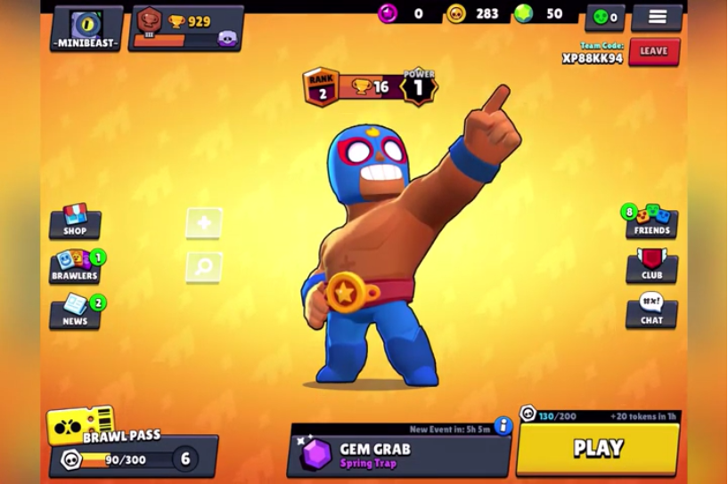

# How to Play Brawl Stars: Menus

In this episode of _How to Play Brawl Stars_, you will learn about the menus in game. Enjoy! Or else...

When you enter brawl stars, you will see the _Supercell_ screen followed by the loading screen. It will have a percentage bar at the bottom. Then you will be taken to the lobby. In the middle is your equipped brawler. Above it is its rank. trophies, power and gadget and star power if applicable. In the bottom this is what you will find from left to right; brawl pass, events and the **PLAY** button, or **I'M READY** if in a team. Then on the left (top to bottom) is trophy road, shop, brawlers and news. At the top is your star points, coins, gems, and menu. Then on the right you will see friends and club. Now let's go over what they all do.
***
***
***Brawl Pass***: This is a 70 tier progression system in which you earn rewards every tier. At the top there is the **Quests** button which allows you to view your current quests, and when there will be new ones.
***
***Events***: There are 7 event slots. Gem grab, showdown (solo and duo), brawl ball, special events, team events 1 & 2 and power play. To learn how to play these, look at **How to Play Brawl Stars: Events**.
*** 
***Play/I'm ready***: This button is the button to go into a match of the selected event. If you are in a team, all players must press _I'm Ready_ for matchmaking to begin.
***
***Trophy Road***: This is the other progression system which gives players a reward upon reaching a certain amount of trophies. The trophy gaps between rewards grow as you get higher in trophies, and the last reward is a mega box at 50,000 trophies.
***
***Shop***: This is where you can purchase items with different in-game currencies. Purchases can also be made with real money, but the option to turn off this is available in the settings on the device you are playing with. There is a daily free reward, and sometimes there will be special offers. You can buy power points, skins, coins, star skins, token doublers and gems in the shop. Don't forget to use your favourite creator code (on the right).
***
***Brawlers***: Shows the brawlers that you have and don't have. This is also where you upgrade your brawlers and equip them, as well as selecting skins. Brawlers can be tried in the _Training Cave_ if you don't have it.
***
***News***: Here you will find the latest news and videos regarding **Brawl Stars**. These vary in topic, from esports to updates. Here you will also find some of the latest **Brawl Stars** videos posted on Youtube by various content creators.
***
***Currencies***: The in-game currencies are coins, gems and star points. You can find out how much you have of each at the top of the lobby screen.
***

[Home](index.html)
[More Tutorials](tutorials.md)