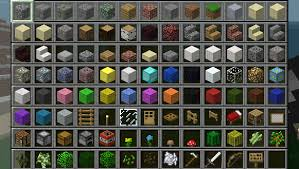

# How to use minecraft pi

## Opening Minecraft Pi

Turn on your pi. It must have raspbian in order for you to use minecraft.
Go to the menu in the top left and in the drop-down find games.
Hover your mouse on games and move it towards the minecraft pi icon that will be there.
Click on minecraft pi. You have opened minecraft!

## Joining a Game

In the minecraft pi start page, click **join game**. It is below **start game**.
It will scan for servers.
You must be on the same wifi to connect to each other’s servers. You can only join pi servers, not other edition servers such as *Java* and *Pocket*. Everyone using a pi is named *StevePi*, and you cannot change it.

## Starting a Game

In the minecraft pi **start page**, click **start game**. It is above **join game**.
Either create a new world (using the **create new** button at the bottom of the window) or click on a world that you have already made.
You will spawn in a random biome (if it is a new world) in creative with limited materials.
Press _e_ to open inventory, where limited blocks will be displayed.
To get out of inventory, either press a block or click *esc* while in inventory menu.
Right click to put down a block, left click to break a block and use your *mouse* to scroll to change materials OR click on the number corresponding to the material eg. if you need bricks and it is the sixth block from the left then click *six* on your *keyboard*.

## Coding

When coding on minecraft pi, you will use the python language. But you can code in ANY app listed in the **programming** section in the **top-left menu**. It just depends on whether you want to run a script altogether or line by line. To connect your code to **minecraft**, always begin with _from mcpi.minecraft import Minecraft_. Then do _mc = Minecraft.create()_ and use whatever code you want. With code, you can create blocks that do not exist in the inventory. This includes **glowing obsidian**, **active furnace** and **water** (flowing or stationary). Keep in mind that you can code in other people’s servers as well, not just your own.

## Extra Information

You can create multiple worlds, but too many will slow down your pi.

To delete worlds, click the **delete** button in the bottom left of the window.

Moving controls are the same as computer _(w,a,s,d)_.

Jumping is the _space_ key.

To fly, double click the _space_ key. When flying lower, hold the _shift_ on the left of the _keyboard_ or tap it if you don’t want to go too much lower. Flying higher is holding/tapping _space_, and to stop flying double tap the _space_ key.

That's basically all you need to know about minecraft pi. Whether you want to play the game normally or with code, everything you need to know is here!

